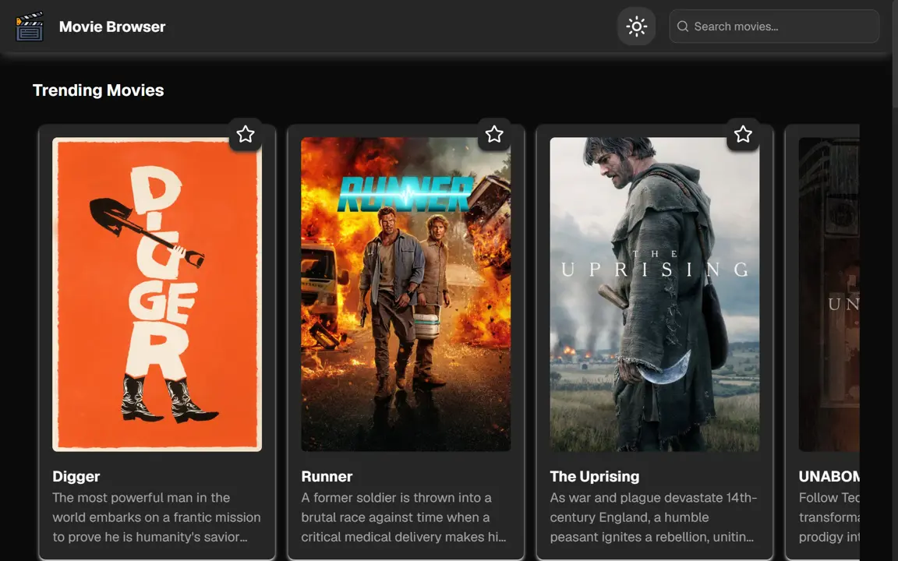
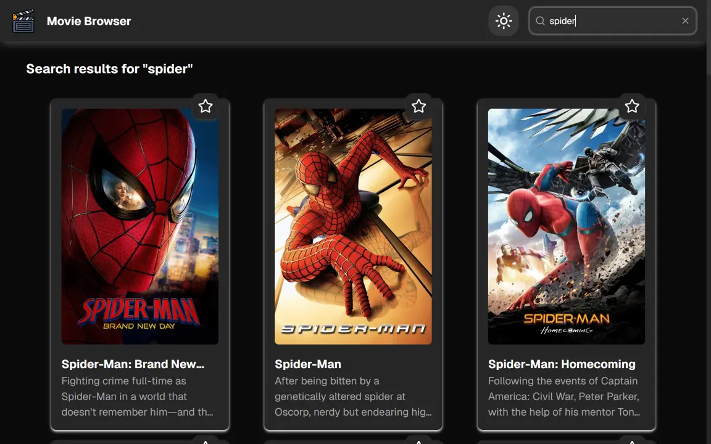

# Movie Browser

Movie Browser is a React and TypeScript movie discovery app that uses Vite and the TMDB API to browse movie collections, search titles, and view detailed movie information.

For an overview of the application architecture and its key design decisions, see the [Architecture Guide](./ARCHITECTURE.md).

**🌐 Live Website:** [movie-browser.haicuong.me](https://movie-browser.haicuong.me/)


The start of the Homepage, showing week trending movies



Search results of query "spider"


## Features

- Browse trending, popular, now-playing, upcoming, and saved favorite movies
- Search for movies with debounced input and URL query state
- Open movie details in a router-backed modal
- View ratings, release dates, genres, runtime, overview, trailer, cast, and crew when available
- Add or remove movies from favorites
- Persist favorites and light/dark theme preferences in browser storage
- Responsive loading, empty, offline, and API error states

## Tech Stack

- React 19
- TypeScript 6
- Vite 8
- React Router
- TanStack React Query
- Zustand
- Tailwind CSS 4
- Base UI, Motion, Lucide, and Geist
- ESLint

## Development Setup

### Prerequisites

- Node.js `^20.19.0` or `>=22.12.0`
- npm
- A TMDB API read access token

The Node.js requirement comes from the Vite version pinned in `package-lock.json`.

### 1. Install dependencies

From the repository root, install the project dependencies:

```bash
npm install
```

### 2. Configure TMDB access

Create an account or sign in at [TMDB](https://www.themoviedb.org/), then create an application in your account settings and copy its API Read Access Token from the [TMDB authentication documentation](https://developer.themoviedb.org/docs/authentication-application).

Create a file named `.env.local` in the project root. Add your TMDB API read access token using the exact variable name below:

```env
TMDB_TOKEN=your_tmdb_read_access_token
```

The local Vite proxy and the Vercel API route both read `TMDB_TOKEN` and send it to TMDB as a Bearer token. `.env.local` is ignored by Git, so do not commit it or share its contents.

### 3. Start the development server

```bash
npm run dev
```

Open the local URL printed by Vite. If you change `TMDB_TOKEN`, stop and restart the dev server so Vite reloads the environment file.

### Deployment environment

For a Vercel deployment, add `TMDB_TOKEN` as an Environment Variable in the Vercel project settings. Do not use the `VITE_` prefix: the token is consumed by the server-side proxy and must not be bundled into client-side JavaScript.

## Available Scripts

| Command           | Description                                                    |
| ----------------- | -------------------------------------------------------------- |
| `npm run dev`     | Start the Vite development server with hot module replacement. |
| `npm run build`   | Run TypeScript project checks and create a production build.   |
| `npm run lint`    | Run ESLint across the repository.                              |
| `npm run preview` | Serve the production build locally.                            |

No automated test script is currently defined in `package.json`.

## Usage

From the home page, browse the movie collections or use the search field to find a title. Select a movie to open its details modal, use the star control to manage favorites, and use the theme control to switch between light and dark themes. Search terms are synchronized with the `q` URL query parameter.

## Routes

| Route         | Description                                                                                            |
| ------------- | ------------------------------------------------------------------------------------------------------ |
| `/`           | Displays the movie collections or search results.                                                      |
| `/movies/:id` | Displays the selected movie in a router-backed modal while preserving the current URL search and hash. |

## Project Structure

```text
api/
└── tmdb-proxy.ts       # Vercel production proxy for TMDB requests
src/
├── api/              # TMDB request helpers
├── components/       # Feature components and UI primitives
├── hooks/            # Search, movie query, theme, favorite, and countdown hooks
├── lib/              # Shared utilities, formatters, and errors
├── types/            # Movie data types
├── App.tsx           # Main page layout
├── index.css         # Tailwind imports and theme tokens
└── main.tsx          # Router and application providers
public/
├── credits/          # In-app attribution assets
└── screenshots/       # README screenshots
vite.config.ts        # Vite config and local TMDB proxy
```

## TMDB Attribution

This product uses the TMDB API but is not endorsed or certified by TMDB. Movie metadata, images, and videos are provided by [TMDB](https://www.themoviedb.org/) and may be subject to its [Terms of Use](https://www.themoviedb.org/terms-of-use).

The application displays the TMDB logo and attribution notice from `public/credits/TMDB.svg` in its footer. The footer also credits the [Business and finance icons created by monkik on Flaticon](https://www.flaticon.com/free-icons/business-and-finance).

## License

This project is licensed under the terms described in the [LICENSE](./LICENSE.md) file.

## Support / Contact

For questions or issues, open an issue in the GitHub repository.
